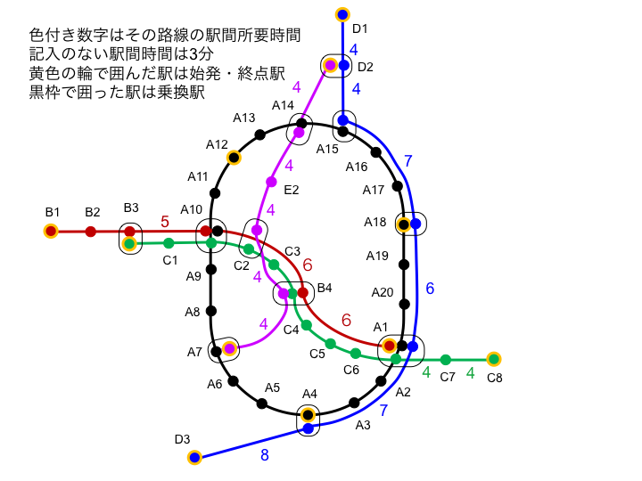

# [上級問題] ほへと市鉄道の乗換案内を作成せよ！



ほへと市には複数の路線が走っています。
これらの路線内の任意の2駅を結ぶ乗換案内のCLIアプリケーションを作成してください。


## 運行に関する条件
- 6:00にすべての始発駅から電車が発車する。環状線は上下線ともに発車する。それ以降の発車間隔は以下のとおり．
  - 路線A 6分
  - 路線B 8分
  - 路線C 6分
  - 路線D 8分
  - 路線E 8分
- 7:00以降（7:00を含む）に始発駅を発車した直後から，環状線Aを除く各線の始発駅からの発車間隔は以下のとおりとなる。
  - 路線B 4分
  - 路線C 4分
  - 路線D 5分
  - 路線E 5分
- 9:00以降（9:00を含む）に始発駅を発車した直後からはまた元の間隔に戻る．
- 環状線Aは7:00以降、先の電車が始発駅の次の駅に着いた時刻に、始発駅を出る電車がなければ、そこから始発電車を出す。
  - このため7時台のいつかは電車が3分間隔になる。
  - 9:00以降は始発駅（終点駅）に7:00以降に始発電車として出発した電車が着いたら、そこをその電車の終点とする。
  - こうして9時台のいつかは6分間隔に戻る。
- 23時以降（23:00を含む）に始発駅を出発する電車はない
- 23時以降（23:00を含む）に電車が始発駅に到着した場合、そこで運行を終える。

## CLIアプリケーションについて
出発駅、到着駅と出発時刻を与えられて最速の乗換経路を示すコンソールアプリケーションを作成しなさい。

このアプリケーションでは引数として以下の3つが与えられます。

- 出発駅名(ex. A1, B3 ...)
- 到着駅名(ex. A1, B3 ...)
- 時刻。HH:MM形式(ex. 08:24)

出力の形式は「路線名 出発駅 出発時刻 到着(乗換)駅 到着時刻」を一行とし、最終到着駅までのすべての電車を出力します。

```
$ myApp A1 C5 08:00
A A1 08:01 A5 09:13
B A5 09:17 B8 10:11
C B8 10:15 C5 11:01
```

※ 入力の引数が不正な場合や到達不可能な場合はエラーメッセージを表示して終了コード(-1)で終了するようにします。

指定の路線、駅、上下における時刻表を出力するコンソールアプリケーションを作成しなさい。
このアプリケーションでは引数として以下の4つが与えられます。

## ヒント
- CLIで指定された出発時刻と出発駅の電車の出発時刻が同じ場合はその電車に乗ることができます。
- 乗換駅で乗換に要する時間は1分です。
  - 乗換駅に10:45に到着した場合、10:46の電車には乗れますが10:45の電車には乗れません。
- 到着駅に同じ時間に到着する経路が複数ある場合は、出発時刻がもっとも遅くなる経路が正解となります。
- 経路の途中で終電となった場合は翌朝の電車に乗る経路を出力してください。


## テストケース
与えられるテストケースはすべてtestcase.txtに記載されています。
正解もあわせて記載されているテストケースはcodecheckコマンドでローカルでも実行可能です。(testフォルダ参照)

正解の記載されていないテストケースはローカルのtestには含まれていませんが、codecheck上の得点には反映されます。
